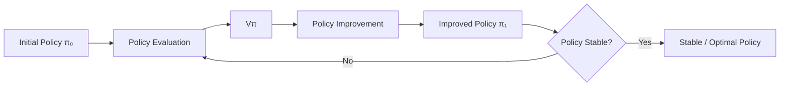

# Grid NxN World Robot — Dynamic Programming in Reinforcement Learning

> A reproducible implementation and visualization of **Sutton & Barto, Reinforcement Learning: An Introduction — Example 4.1**, developed only from concepts introduced through **Chapter 4.3: Policy Iteration**.

<p align="center">
  <strong>MDP Modeling → Policy Evaluation → Policy Improvement → Policy Iteration → Stable Greedy Policy</strong>
</p>

---

## Project Scope

This repository separates two concerns:

| Component             | Responsibility                                                    |
| --------------------- | ----------------------------------------------------------------- |
| `grid_nxn_world`      | Reusable NxN graphical GridWorld and robot renderer               |
| `play_4x4_world_game` | Sutton & Barto Example 4.1 MDP and Dynamic Programming algorithms |

The main architectural principle is:

```text
Reinforcement-Learning Logic
            │
            │ optional visualization
            ▼
        GridWorld
            │
     ┌──────┼──────┐
     ▼      ▼      ▼
   Grid   Robot   Paint
```

The renderer does **not** determine rewards, transitions, policies, or values.

The RL implementation can therefore be reasoned about and tested independently from Pygame.

---

# 1. Introduction and Objectives

This project was developed as a practical study of **finite Markov Decision Processes and Dynamic Programming**, using the 4×4 GridWorld from Sutton & Barto's Example 4.1.

The implementation follows three primary objectives.

### 1. Build a reusable NxN visual environment

Develop a graphical GridWorld capable of supporting:

- configurable \(N\times N\) grids,
- robot movement,
- animation,
- terminal-cell visualization,
- path tracing,
- keyboard interaction,
- automated testing,
- hot reload and cold reload during development.

The renderer is accessed through a single `GridWorld` façade.

---

### 2. Implement the 4×4 task as a proper MDP

Represent Example 4.1 independently from rendering.

The state space is:

$$
\mathcal{S}=\{0,1,\ldots,15\}
$$

with terminal states:

$$
\mathcal{S}^{+}=\{0,15\}
$$

and nonterminal states:

$$
\mathcal{S}_{NT}=\{1,2,\ldots,14\}.
$$

The action space is:

$$
\mathcal{A}=
\{
\uparrow,\downarrow,\leftarrow,\rightarrow
\}.
$$

For every nonterminal transition:

$$
R_{t+1}=-1.
$$

The task is:

- **episodic**,
- **undiscounted**,
- **deterministic in its transitions**,
- evaluated with

$$
\gamma=1.
$$

Actions attempting to leave the grid leave the state unchanged.

For example:

$$
5 \xrightarrow{\text{RIGHT}} 6
$$

while:

$$
7 \xrightarrow{\text{RIGHT}} 7.
$$

---

### 3. Implement Dynamic Programming through Policy Iteration

Starting from the equiprobable random policy:

$$
\pi(a|s)=\frac14,
$$

the project implements:

- iterative policy evaluation,
- state-value estimation,
- one-step action-value calculation,
- greedy policy improvement,
- policy comparison,
- policy iteration,
- policy-stability detection,
- visualization of sampled policy behavior.

The implementation intentionally stops at **Chapter 4.3 — Policy Iteration**.

> Monte Carlo, Temporal-Difference learning, SARSA, Q-learning, and later methods are outside the scope of this experiment.

---

# 2. Mathematical Formulation

## Bellman Expectation Equation

For a policy \(\pi\),

$$
v_\pi(s)
=
\sum_a
\pi(a|s)
\sum_{s',r}
p(s',r|s,a)
\left[
r+\gamma v_\pi(s')
\right].
$$

Because this environment has deterministic transitions, the update simplifies to:

$$
v_\pi(s)
=
\sum_a
\pi(a|s)
\left[
r+\gamma v_\pi(s')
\right].
$$

For the equiprobable random policy:

$$
v_\pi(s)
=
\frac14
\sum_{a\in\mathcal{A}}
\left[
-1+v_\pi(s')
\right].
$$

---

## Interpretation of the State Values

Because every transition has reward \(-1\) and \(\gamma=1\),

$$
v_\pi(s)
=
-\mathbb{E}_{\pi}
[
\text{number of steps until termination}
\mid S_0=s
].
$$

Therefore a value such as:

$$
v_\pi(1)\approx-14
$$

means that under the equiprobable random policy, starting from state `1` requires approximately **14 steps on average** to terminate.

---

# 3. Benchmark Results

## Equiprobable Random Policy

Iterative policy evaluation produces approximately:

```text
  0  -14  -20  -22
-14  -18  -20  -20
-20  -20  -18  -14
-22  -20  -14    0
```

The most negative states require approximately **22 expected transitions** before termination under the random policy.

---

## Policy Improvement

For every state-action pair, one-step action values are calculated using:

$$
q_\pi(s,a)
=
r+\gamma v_\pi(s').
$$

The improved policy selects:

$$
\pi'(s)
\in
\arg\max_a q_\pi(s,a).
$$

Multiple actions may belong to the argmax when their action values are equal.

For example, from state `10`:

```text
10 ──DOWN──> 14 ──RIGHT──> 15

10 ──RIGHT─> 11 ──DOWN───> 15
```

Both routes require two transitions.

---

## Stable Policy after Policy Iteration

After **3 policy-iteration rounds**, the final state-value function becomes:

```text
 0  -1  -2  -3
-1  -2  -3  -2
-2  -3  -2  -1
-3  -2  -1   0
```

These values correspond directly to the shortest number of transitions required to reach a terminal state.

For example:

$$
V^*(1)=-1
$$

because:

```text
1 ──LEFT──> 0
```

whereas:

$$
V^*(3)=-3.
$$

---

# 4. Project Architecture

```text
src/
│
├── grid_nxn_world/
│   ├── __init__.py
│   ├── __main__.py
│   ├── config.py
│   ├── events.py
│   ├── grid.py
│   ├── paint.py
│   ├── robot.py
│   └── world.py
│
└── play_4x4_world_game/
    ├── __init__.py
    ├── environment.py
    ├── policy.py
    ├── policy_evaluation.py
    ├── policy_improvement.py
    ├── policy_iteration.py
    ├── play_and_render.py
    ├── utils.py
    │
    └── assets/
        └── goal.wav
```

### Responsibility Boundary

```text
play_4x4_world_game
│
├── What is a state?
├── What actions exist?
├── What transition occurs?
├── What reward is received?
├── What is π(a|s)?
├── What is Vπ(s)?
└── How should π be improved?

                │
                │ visualization only
                ▼

grid_nxn_world
│
├── Draw the grid
├── Draw the robot
├── Animate movement
├── Trace trajectories
├── Highlight terminal states
└── Process rendering events
```

This separation is intentional.

> The robot does not learn because it visually moves.  
> Dynamic Programming computes the policy from the complete environment model; the renderer demonstrates the resulting policy behavior.

---

# 5. Development Phases

## Phase I — NxN Rendering Environment

The initial phase developed a reusable visual GridWorld.

### Features

- [x] Configurable NxN grid
- [x] Robot animation
- [x] Boundary handling
- [x] Grid-coordinate rendering
- [x] Terminal-cell visualization
- [x] Episode path tracing
- [x] Goal feedback
- [x] Pygame rendering
- [x] Automated tests
- [x] Hot reload
- [x] Cold reload
- [x] VS Code debugging

The public interface is intentionally centered around:

```python
from grid_nxn_world import GridWorld
```

rather than requiring external code to manipulate `Grid`, `Robot`, `Paint`, or Pygame directly.

---

## Phase II — MDP Implementation

The second phase implemented the mathematical environment.

A transition is represented as:

```python
next_state, reward, terminated = env.step(
    state,
    action,
)
```

Conceptually:

$$
(S_t,A_t)
\longrightarrow
(R_{t+1},S_{t+1}).
$$

The implementation verifies:

- valid states,
- valid actions,
- deterministic transitions,
- wall behavior,
- terminal states,
- rewards,
- episode termination.

Example:

```python
next_state, reward, terminated = env.step(
    5,
    Action.RIGHT,
)
```

returns conceptually:

```python
(6, -1.0, False)
```

---

## Phase III — Dynamic Programming

The final phase implemented the progression:



### Policy Evaluation

```text
πₖ fixed
   │
   ▼
V₀
 ↓
V₁
 ↓
V₂
 ↓
...
 ↓
Vπₖ
```

The policy remains fixed while its value function converges.

### Policy Improvement

```text
Vπₖ
 │
 ▼
qπ(s,a)
 │
 ▼
argmax
 │
 ▼
πₖ₊₁
```

### Policy Iteration

```text
π₀
↓ evaluate
Vπ₀
↓ improve
π₁
↓ evaluate
Vπ₁
↓ improve
π₂
↓
...
↓
stable policy
```

---

# 6. How to Run

## Prerequisites

- Python 3.12+
- Poetry

Clone the repository:

```bash
git clone https://github.com/ignius299792458/grid-NxN-world-robot-rl.git
```

Enter the project directory:

```bash
cd grid-NxN-world-robot-rl
```

Install dependencies:

```bash
poetry install
```

---

## Run the Generic NxN Renderer

```bash
poetry run python -m grid_nxn_world
```

This launches the reusable visual GridWorld independently from the RL experiment.

---

## Run the Sutton & Barto 4×4 Experiment

```bash
poetry run python -m play_4x4_world_game.play_and_render
```

The demonstration visualizes:

1. the current policy,
2. sampled robot behavior,
3. terminal states,
4. episode trajectories,
5. policy improvement,
6. subsequent policy iterations,
7. final stable behavior.

---

## Run the Test Suite

```bash
poetry run pytest
```

For more verbose output:

```bash
poetry run pytest -v
```

Tests cover both the renderer and the MDP implementation.

---

# 7. Development and Debugging

## Hot Reload

The project uses `jurigged` for live Python code patching.

```bash
poetry run python script/hot_reload.py
```

Changes inside:

```text
src/
```

are monitored while the program remains active.

This is useful for modifying rendering behavior without repeatedly restarting the application manually.

---

## Auto Reload

The cold-reload workflow uses `hupper`.

```bash
poetry run python script/auto_reload.py
```

When a watched source file changes, the running process is restarted.

Use this when a modification cannot safely be hot-patched.

---

## VS Code Debugger

The repository includes launch configurations for:

```text
Current Py File
Grid NxN World
Auto-Reload: Grid World
Hot-Reload: Grid World
```

The debugger configures:

```text
PYTHONPATH=${workspaceFolder}/src
```

so source-layout packages can be imported directly while debugging.

<details>
<summary><strong>When should I use each development mode?</strong></summary>

| Mode             | Appropriate use                                       |
| ---------------- | ----------------------------------------------------- |
| Normal execution | General testing and demonstrations                    |
| VS Code debugger | Breakpoints, variable inspection, call-stack analysis |
| Hot reload       | Fast rendering/UI experimentation                     |
| Auto reload      | Structural changes requiring process restart          |
| `pytest`         | Behavioral and mathematical verification              |

</details>

---

# 8. Rendering vs Learning

This distinction is important when interpreting the demonstration.

The visible robot trajectory is a **sample from the current policy**.

For example, under the equiprobable random policy:

$$
\pi(a|s)=0.25.
$$

A rendered episode randomly samples actions according to those probabilities.

Therefore two rendered episodes can follow different trajectories.

However, iterative policy evaluation itself does not estimate values from those sampled episodes.

It directly evaluates the expectation:

$$
v_\pi(s)
=
\sum_a
\pi(a|s)
\left[
r+\gamma v_\pi(s')
\right].
$$

Thus:

> **Rendering is demonstration. Dynamic Programming is planning.**

This distinction is important because later model-free RL algorithms such as Monte Carlo and Temporal-Difference methods _do_ learn from sampled experience,
